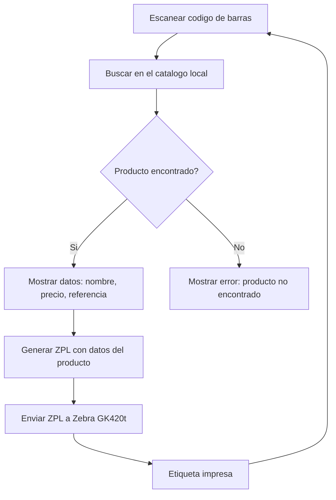

# Flujo Principal

## Descripcion

El flujo principal es el ciclo basico del sistema: escanear un producto, consultar sus datos, y imprimir la etiqueta.

## Pasos del Flujo

## Detalle de cada paso

### 1. Escaneo
- Lector USB conectado al PC
- Funciona como teclado: escribe el codigo + Enter
- El programa captura el codigo automaticamente

### 2. Consulta de producto
- Busqueda en el catalogo local (`product.repository`)
- Parametro: codigo de barras
- Respuesta: Producto con nombre, precio, referencia

### 3. Validacion
- Si el producto existe → mostrar datos
- Si no existe → mostrar mensaje de error
- El operador puede reintentar

### 4. Generacion de etiqueta
- Construir comando ZPL con los datos
- Incluir: nombre, codigo de barras, precio, referencia

### 5. Impresion
- Enviar ZPL directo a la impresora via USB
- Sin ventanas de dialogo de Windows
- Impresion instantanea

## Ver tambien

- [[Modo Continuo]]
- [[ZPL Lenguaje Impresion]]
- [[Objetivo del Proyecto]]
